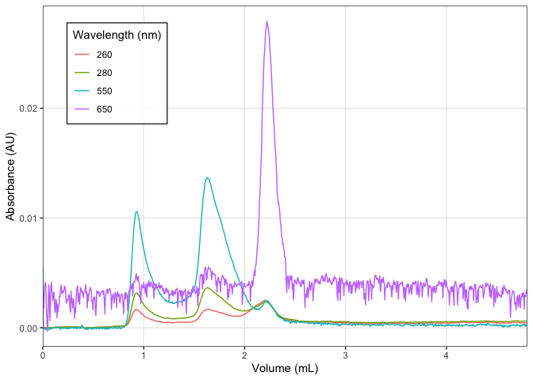
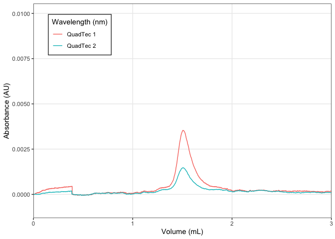

<!-- README.md is generated from README.Rmd. Please edit that file -->

# chromr

<!-- badges: start -->

[](https://app.codecov.io/gh/BradyAJohnston/chromr?branch=main)
[](https://github.com/BradyAJohnston/chromr/actions/workflows/R-CMD-check.yaml)
<!-- badges: end -->

The goal of chromr is to …

## Installation

You can install the development version of chromr from
[GitHub](https://github.com/) with:

``` r
# install.packages("devtools")
devtools::install_github("BradyAJohnston/chromr")
```

## Example

This is a basic example which shows you how to solve a common problem:

``` r
library(chromr)
## basic example code
```

``` r
fl <- system.file(
  "extdata",
  "sec.txt", 
  package = "chromr"
)

fl |> 
  chrom_read_quadtech() |> 
  chrom_plot()
#> Warning: One or more parsing issues, see `problems()` for
#> details
#> [1] TRUE
#> Warning: Removed 40 row(s) containing missing values
#> (geom_path).
```



``` r
fl <- system.file(
  "extdata",
  "sec_no_volume.txt", 
  package = "chromr"
)

fl |> 
  chrom_read_quadtech() |> 
  chrom_add_volume(0.3) |> 
  chrom_plot() + 
  ggplot2::coord_cartesian(xlim = c(0, 3), ylim = c(NA, 0.01))
#> Warning: One or more parsing issues, see `problems()` for
#> details
#> [1] FALSE
#> Coordinate system already present. Adding new coordinate system, which will replace the existing one.
```


