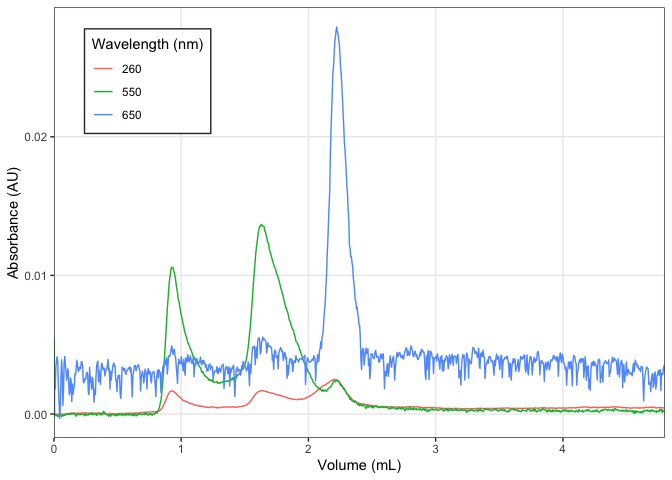
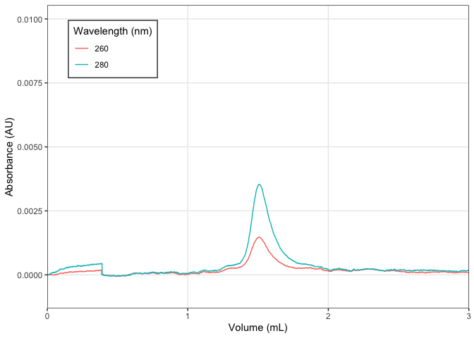
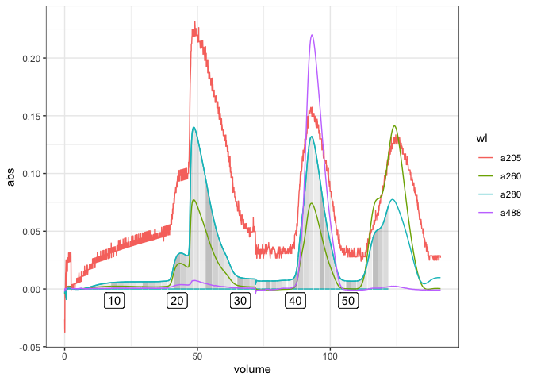

<!-- badges: start -->

[](https://app.codecov.io/gh/BradyAJohnston/chromr?branch=main)
[](https://github.com/BradyAJohnston/chromr/actions/workflows/R-CMD-check.yaml)

<!-- badges: end -->

The goal of chromr is to …

## Installation

You can install the development version of chromr from
[GitHub](https://github.com/) with:

``` r
# install.packages("devtools")
install.packages("BradyAJohnston/chromr", repos = c("https://bradyajohnston.r-universe.dev"))
```

## Example

Reading of chromatogram files and plotting from the BioRad QuadTech.

``` r
library(chromr)
library(ggplot2)
```

``` r
fl <- system.file(
  "extdata",
  "example_quadtec_3.txt", 
  package = "chromr"
)

dat <- fl |> 
  chrom_read_quadtech()
dat
```

    ## # A tibble: 960 × 10
    ##     time percent_b    au m_s_cm   psi  volume    a280     a260     a550     a650
    ##    <dbl>     <dbl> <dbl>  <dbl> <dbl>   <dbl>   <dbl>    <dbl>    <dbl>    <dbl>
    ##  1     0         0     0   16.0   265 0        0       0        5.51e-3  0      
    ##  2     1         0     0   16.0   266 0.00501  4  e-6  1.3 e-5 -1.6 e-4  1.87e-3
    ##  3     2         0     0   16.0   270 0.0100   0      -8   e-6 -6.40e-5  1.80e-3
    ##  4     3         0     0   16.0   272 0.0150  -1.3e-5 -2.20e-5 -6.40e-5  3.39e-3
    ##  5     4         0     0   16.0   272 0.0200  -6  e-6 -1.5 e-5 -9.5 e-5  3.91e-3
    ##  6     5         0     0   16.0   276 0.0250  -6  e-6 -1.80e-5 -1.28e-4  4.13e-3
    ##  7     6         0     0   16.0   275 0.0300  -6  e-6 -2.90e-5 -1.93e-4  3.76e-3
    ##  8     7         0     0   16.0   273 0.0350  -2  e-6 -8   e-6 -1.28e-4  1.92e-3
    ##  9     8         0     0   16.0   273 0.0400   3  e-6 -1.10e-5 -6.40e-5  8.83e-4
    ## 10     9         0     0   16.0   275 0.0450  -8  e-6 -9   e-6 -9.60e-5 -3.2 e-4
    ## # ℹ 950 more rows

``` r
dat |> 
  dplyr::select(-a280) |> 
  chrom_plot(ylim = c())
```

<!-- -->

``` r
fl <- system.file(
  "extdata",
  "example_quadtec_4.txt", 
  package = "chromr"
)

fl |> 
  chrom_read_quadtech() |> 
  chrom_add_volume(0.3) |> 
  chrom_plot(xlim = c(0, 3), ylim = c(NA, 0.01))
```

<!-- -->

## Fractions2

``` r
fl1 <- system.file("extdata", "example_quadtec_1.TXT", package = "chromr")
fl2 <- system.file("extdata", "example_quadtec_2.TXT", package = "chromr")
df1 <- chrom_read_quadtech(fl1)
df2 <- chrom_read_quadtech(fl2)
dat <- chrom_append_run(df1, df2)

dat |>
  dplyr::slice_sample(prop = 0.1) |>
  pivot_wl_longer() |>
  ggplot(aes(volume, abs, fraction = fraction, group = wl)) +
  geom_fraction_bars(aes(color = wl), lines = "a280") +
  
  geom_line(aes(color = wl)) +
  geom_fraction_label(colour = "black", ypos = -0.01, period = 10) +
  scale_fill_grey() +
  theme_bw()
```

<!-- -->
