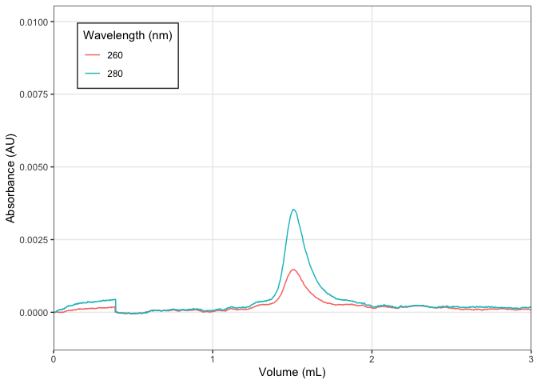

<!-- README.md is generated from README.Rmd. Please edit that file -->

# chromr

<!-- badges: start -->

[](https://app.codecov.io/gh/BradyAJohnston/chromr?branch=main)
[](https://github.com/BradyAJohnston/chromr/actions/workflows/R-CMD-check.yaml)

<!-- badges: end -->

The goal of chromr is to …

## Installation

You can install the development version of chromr from
[GitHub](https://github.com/) with:

``` r
# install.packages("devtools")
devtools::install_github("BradyAJohnston/chromr")
```

## Example

Reading of chromatogram files and plotting from the BioRad QuadTech.

``` r
library(chromr)
## basic example code
```

``` r
fl <- system.file(
  "extdata",
  "sec.txt", 
  package = "chromr"
)

dat <- fl %>% 
  chrom_read_quadtech()
dat
#> # A tibble: 960 × 10
#>     time percent_b    au m_s_cm   psi  volume     a280    a260     a550     a650
#>    <dbl>     <dbl> <dbl>  <dbl> <dbl>   <dbl>    <dbl>   <dbl>    <dbl>    <dbl>
#>  1     0         0     0   16.0   265 0         0       0       5.50e-3  0      
#>  2     1         0     0   16.0   266 0.00501   4  e-6  1.3e-5 -1.6 e-4  1.88e-3
#>  3     2         0     0   16.0   270 0.0100    0      -8  e-6 -6.4 e-5  1.80e-3
#>  4     3         0     0   16.0   272 0.0150   -1.3e-5 -2.2e-5 -6.4 e-5  3.39e-3
#>  5     4         0     0   16.0   272 0.0200   -6  e-6 -1.5e-5 -9.5 e-5  3.91e-3
#>  6     5         0     0   16.0   276 0.0250   -6  e-6 -1.8e-5 -1.28e-4  4.13e-3
#>  7     6         0     0   16.0   275 0.0300   -6  e-6 -2.9e-5 -1.93e-4  3.76e-3
#>  8     7         0     0   16.0   273 0.0350   -2  e-6 -8  e-6 -1.28e-4  1.92e-3
#>  9     8         0     0   16.0   273 0.0400    3  e-6 -1.1e-5 -6.4 e-5  8.83e-4
#> 10     9         0     0   16.0   275 0.0450   -8  e-6 -9  e-6 -9.6 e-5 -3.2 e-4
#> # … with 950 more rows
```

``` r
dat |> 
  dplyr::select(-a280) |> 
  chrom_plot(ylim = c())
```


``` r
fl <- system.file(
  "extdata",
  "sec_no_volume.txt", 
  package = "chromr"
)

fl %>% 
  chrom_read_quadtech() %>% 
  chrom_add_volume(0.3) %>% 
  chrom_plot(xlim = c(0, 3), ylim = c(NA, 0.01))
```



## Fractions2

``` r
fl1 <- system.file("extdata",
                   "20220809_SFPQfl_TEVdig_S200_part1.TXT",
                   package = "chromr")
fl2 <- system.file("extdata",
                   "20220809_SFPQfl_TEVdig_S200_part2.TXT",
                   package = "chromr")
df1 <- chrom_read_quadtech(fl1)
df2 <- chrom_read_quadtech(fl2)
dat <- chrom_append_run(df1, df2)

chrom_plot_fractions(dat, wl_frac = 280)
```


